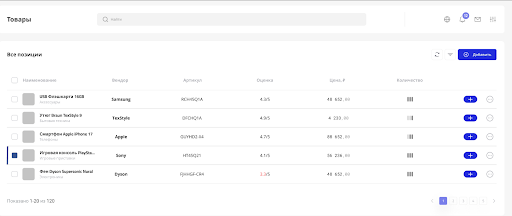

# Catalog Admin

Админ-панель каталога товаров, выполненная как тестовое задание.

## Что реализовано

- авторизация через DummyJSON API;
- `remember me` с сохранением токена в `localStorage` / `sessionStorage`;
- guards для маршрутов `/login` и `/products`;
- страница товаров с:
  - таблицей;
  - пагинацией;
  - поиском через API;
  - debounce для поиска;
  - refresh;
  - локальным добавлением товара через modal;
- обработка состояний загрузки и ошибок;
- улучшенная декомпозиция и более чистая архитектура в стиле FSD-lite.

---

## Скриншоты

### Страница логина


### Таблица товаров



---

## Демо-доступ

Для входа можно использовать:

- **Логин:** `emilys`
- **Пароль:** `emilyspass`

---

## Стек

- **Vite**
- **React**
- **TypeScript**
- **Effector**
- **Patronum**
- **Ant Design**
- **CSS Modules**
- **React Router**

---

## Запуск проекта

### 1. Установить зависимости

```bash
pnpm install
```

### 2. Запустить проект в dev-режиме

```bash
pnpm dev
```

### 3. Собрать production build

```bash
pnpm build
```

### 4. Локально проверить production build

```bash
pnpm preview
```

### 5. Проверить линтер, если подключён

```bash
pnpm lint
```

---

## Маршруты

- `/login` — страница авторизации
- `/products` — страница товаров

---

## Основной функционал

### Авторизация

- логин через API;
- обработка ошибки неверного логина / пароля;
- сохранение токена в зависимости от `remember me`;
- защита приватных маршрутов;
- редирект авторизованного пользователя с `/login` на `/products`.

### Товары

- загрузка списка товаров с сервера;
- пагинация;
- поиск через API;
- debounce для поля поиска;
- refresh текущего списка;
- локальное добавление товара;
- отображение loading и error states.

---

## Архитектурные улучшения

В процессе доработки проект был приведён к более аккуратной структуре в стиле **FSD-lite**.

### Что было улучшено

- UI-компоненты стали тоньше;
- часть бизнес-логики вынесена из компонентов в `model`;
- таблица товаров вынесена в `widgets`;
- feature-компоненты стали более самостоятельными;
- типы перестали дублироваться;
- API-слой стал безопаснее за счёт runtime-парсинга ответов;
- orchestration в `entities/products/model` был разрезан на отдельные сценарии.

### Примеры изменений

- `ProductsTable` больше не хранит у себя всю внутреннюю бизнес-логику;
- `LoginForm` стал в основном UI + form wiring;
- `AddProductModal` стал самостоятельной feature;
- поиск и refresh отделены от page-слоя;
- `fetchLogin` и `fetchProducts` используют отдельный parse-слой;
- `init.ts` в модели товаров разрезан на сценарии:
  - bootstrap
  - search
  - pagination
  - refresh
  - addProduct
  - apiSync

---

## Структура проекта

```text
src/
  app/
    App.tsx
    router.tsx

  pages/
    LoginPage/
    ProductsPage/

  widgets/
    ProductsTable/

  features/
    LoginForm/
    Search/
    AddProductModal/
    RefreshProductsButton/

  entities/
    auth/
    products/

  shared/
    lib/
    routing/

  assets/
```

---

## Примечания

- добавление товара сейчас локальное и не отправляется на сервер;
- новые товары корректно встраиваются в список на первой странице;
- поиск работает через API;
- проект успешно проходит `pnpm build`.

---

## Возможные дальнейшие улучшения

- lazy loading страниц;
- дополнительная оптимизация bundle size;
- unit / integration tests;
- более глубокое разделение features по бизнес-сценариям;
- серверное добавление / редактирование / удаление товаров.
